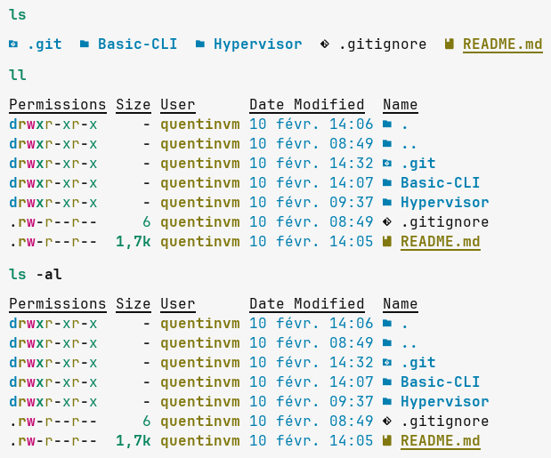
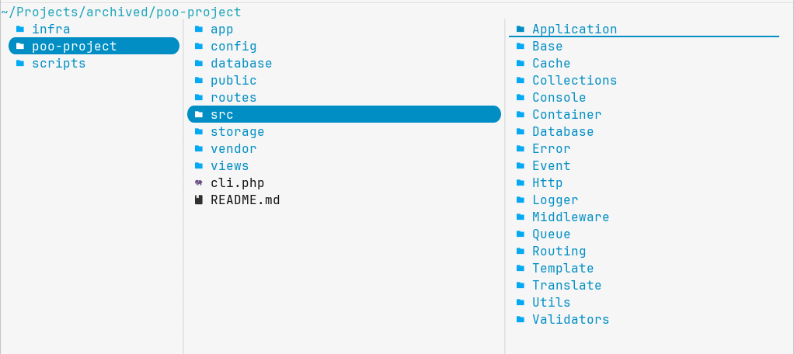

# Les outils basiques

Voici une liste d'outil basique pour le terminal.

- [Les outils basiques](#les-outils-basiques)
  - [ncdu](#ncdu)
    - [Installation sur `CachyOS` :](#installation-sur-cachyos-)
  - [btop](#btop)
    - [Installation sur `CachyOS` :](#installation-sur-cachyos--1)
  - [eza (Remplace ls)](#eza-remplace-ls)
    - [Installation sur `CachyOS` :](#installation-sur-cachyos--2)
    - [Ajout comme alias :](#ajout-comme-alias-)
  - [bat (remplace cat)](#bat-remplace-cat)
    - [Installation sur `CachyOS` :](#installation-sur-cachyos--3)
  - [yazi](#yazi)
    - [Installation sur `CachyOS` :](#installation-sur-cachyos--4)


## ncdu

**ncdu** pour **NC**urses **D**isk **U**sage, permet de lister les fichiers et dossiers
en triant par taille. [Lien vers l'outil](https://dev.yorhel.nl/ncdu).

### Installation sur `CachyOS` :

```bash
sudo pacman -S ncdu
```


## btop

**btop** ou BashTop++, permet de monitorer les ressources de base du système (CPU, Ram, Network, Process, GPU).
Le [lien vers l'outil](https://github.com/aristocratos/btop).

### Installation sur `CachyOS` :

```bash
sudo pacman -S btop
```


## eza (Remplace ls)

**eza** est une alternative moderne à **ls**. Il permet plus d'option que ls.
[Lien de l'outil](https://github.com/eza-community/eza)

### Installation sur `CachyOS` :

```bash
sudo pacman -S eza
```

### Ajout comme alias :

En fonction de votre type de shell, la configuration des alias n'est pas la même.

Dans du **bash**, il faut modifier le fichier `~/.bashrc` avec les lignes
```bash
alias ls='eza -ha --group-directories-first --icons'
alias ll='eza -lhaa --group-directories-first --icons'
```

Pour **zsh** c'est le fichier `~/.zshrc` avec le même contenu et pour **fish**
c'est le fichier `~/.config/fish/config.fish` avec aussi le même contenu.
Finir avec un `source [chemin-fichier]` ou de (re) lancer un terminal.




## bat (remplace cat)

**bat** est un clone de la commande **cat**. Il peut regarder plusieurs fichier et permet une recherche
dans le résultat. Il permet aussi de voir les diff git du dossier. [Lien de l'outil](https://github.com/sharkdp/bat)

### Installation sur `CachyOS` :

```bash
sudo pacman -S bat
```


## yazi

Il s'agit d'un explorateur de fichier pour le terminal. [Lien de l'outil](https://yazi-rs.github.io/docs/quick-start)
Il peut être combiner avec d'autres outils comme **jq** ou **fd**.

### Installation sur `CachyOS` :

```bash
sudo pacman -S yazi
```

Voici une liste d'outil intéressant en combinaison avec **yazi** :

```bash
# JSON Preview
sudo pacman -S jq

# File Searching
sudo pacman -S fd

# Fuzzy search
sudo pacman -S fzf

# Content search (rg)
sudo pacman -S ripgrep
```



