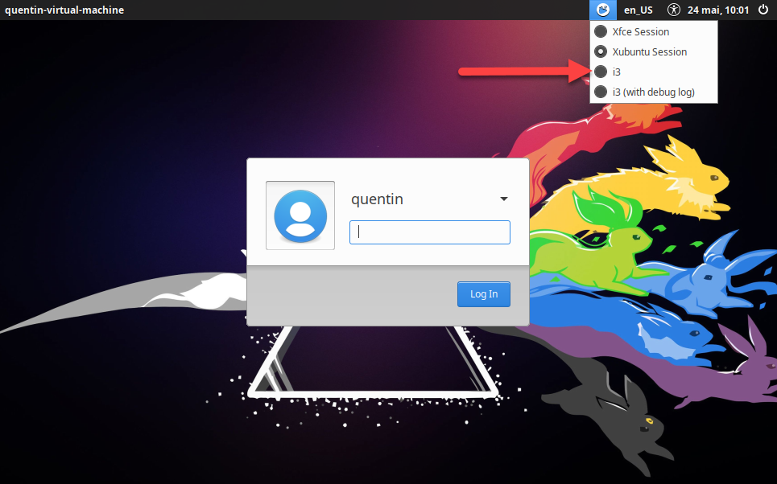

## i3 (install step by step)

L'installation de i3 se fait assez simplement avec la commande :
```bash
sudo apt install i3
```

Ensuite il faut se déconnecter et relancer la session en choisissant i3 dans le menu de session :



Une fois choisi et votre mot de passe entré, une petite fenêtre vous demandera si vous voulez une configuration de base. Il vaut mieux en avoir une qu l'on remplacera plus tard par une version personalisé

Dans le fichier `~/.config/i3/config` on va repartir sur de bonne base avec cette configuration (il faut donc remplacer tout le contenu du fichier) :

```ini
# Touche principale pour les raccourcis (Windows Key)
set $mod Mod4

# Modification de la font
font pango:DejaVu Sans Mono 9

# Bind important
# Recharge le fichier de configuration i3
bindsym $mod+Shift+c reload
bindsym $mod+Shift+r restart
# Kill
bindsym $mod+Shift+a kill

# Ouvre le terminal
bindsym $mod+Return exec i3-sensible-terminal
# Ouvre le start menu
bindsym $mod+d exec dmenu_run

# Switch de fenêtre (focus)
bindsym $mod+Left focus left
bindsym $mod+Down focus down
bindsym $mod+Up focus up
bindsym $mod+Right focus right

# Switch de fenêtre (déplacement)
bindsym $mod+Shift+Left focus left
bindsym $mod+Shift+Down focus down
bindsym $mod+Shift+Up focus up
bindsym $mod+Shift+Right focus right

# Orientation
bindsym $mod+h split h
bindsym $mod+v split v

bindsym $mod+f fullscreen toggle
bindsym $mod+z layout tabbed
bindsym $mod+e layout toggle split
bindsym $mod+Shift+space floating toggle

# Workspace
set $ws1 "1"
set $ws2 "2"
set $ws3 "3"
set $ws4 "4"
set $ws5 "5"
set $ws6 "6"
set $ws7 "7"
set $ws8 "8"
set $ws9 "9"
set $ws10 "10"

# Change de workspace
bindsym $mod+ampersand workspace number $ws1
bindsym $mod+eacute workspace number $ws2
bindsym $mod+quotedbl workspace number $ws3
bindsym $mod+apostrophe workspace number $ws4
bindsym $mod+parenleft workspace number $ws5
bindsym $mod+minus workspace number $ws6
bindsym $mod+egrave workspace number $ws7
bindsym $mod+underscore workspace number $ws8
bindsym $mod+ccedilla workspace number $ws9
bindsym $mod+agrave workspace number $ws10

# Change la fenêtre actuel de workspace
bindsym $mod+Shift+ampersand move container to workspace number $ws1
bindsym $mod+Shift+eacute move container to workspace number $ws2
bindsym $mod+Shift+quotedbl move container to workspace number $ws3
bindsym $mod+Shift+apostrophe move container to workspace number $ws4
bindsym $mod+Shift+5 move container to workspace number $ws5
bindsym $mod+Shift+minus move container to workspace number $ws6
bindsym $mod+Shift+egrave move container to workspace number $ws7
bindsym $mod+Shift+underscore move container to workspace number $ws8
bindsym $mod+Shift+ccedilla move container to workspace number $ws9
bindsym $mod+Shift+agrave move container to workspace number $ws10

# Permet de resize des fenêtres
mode "resize" {
        # Resize
        bindsym Left resize shrink width 10 px or 10 ppt
        bindsym Down resize grow height 10 px or 10 ppt
        bindsym Up resize shrink height 10 px or 10 ppt
        bindsym Right resize grow width 10 px or 10 ppt

        # Permet de quitter le mode resize
        bindsym Return mode "default"
        bindsym Escape mode "default"
        bindsym $mod+r mode "default"
}

bindsym $mod+r mode "resize"

for_window [class="^.*"] border pixel 0
```

Pour changer le menu des applications par défaut c'est ici : 
[Installation de rofi](./rofi.md)

Gestion des workspaces (multi screen possible) :
[Workspace](./workspace.md)

Pour changer l'apparence il y a :
```bash
sudo apt install lxappearance
```

Pour changer la barre avec polybar : 
[Installation de polybar](./polybar.md)

Pour vérouiller son PC
[Installation du lock](./lock.md)
