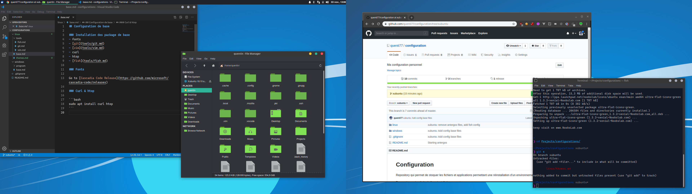

## Themes & icons

Themes vimix : [https://www.gnome-look.org/p/1013698/](https://www.gnome-look.org/p/1013698/)

1. Mettre les dossiers du theme dans /usr/share/themes
2. Pour activer le themes il faut le changer dans Appearance ET Window Manager
3. Mettre les dossiers des icones dans /usr/share/icons
4. Icons tab dans Appearance

